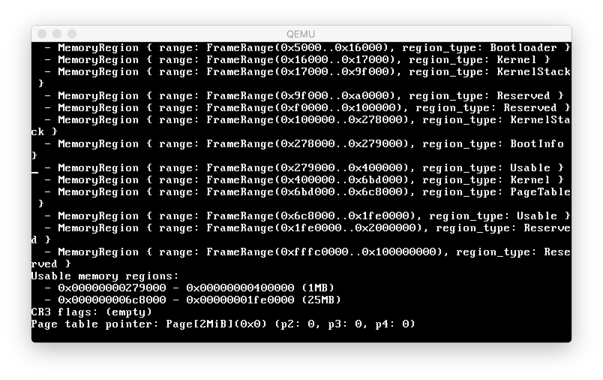

# Kernel

This is a place for me to tinker around with kernel development. Feel free to tinker, and let me know if you run into problems. Set your expectations low, then go way *way* lower.



## Running

### Setup

This requires a bit of a weird Rust development environment. Roughly you'll need:

* A Rust installation installed through `rustup`. This only works on nightly versions since about August 2018.
* *Mac OS X:* A cross-compiled version of binutils as described here: https://os.phil-opp.com/cross-compile-binutils/
* A checkout of the Bootloader crate checked out next to this: https://github.com/rust-osdev/bootloader/
  * In `x86_64-bootloader.json` you'll need to change the `"linker"` setting to `"x86_64-elf-ld.bfd"`, to point to the cross-compiled binutils from above.

After that, you should be able to run this to get the rest of the dependencies:

```
make setup
```

### Running

To run in Qemu:

```
make run
```

## Status

* [x] It boots!
* [x] Simple VGA driver
  * [x] Rust runtime support for `println!`
* [x] Interrupts
* [ ] Paging (WIP)
* [ ] User mode task switching
* [ ] RTL8139 network driver
* [ ] *a million other things*
